# LDP Data Model — Handover Modules

**Purpose.** The Phase I data model, broken into six modules small enough to teach in one
sitting each. Built for transitioning the project to new team members.

**Authority.** Everything here was verified against `build/scripts/New-LdpSharePointLists.ps1`
and the per-list specs in `build/lists/`. Those are the source of truth.

> ### Read this before anything else
>
> **`docs/LDP_Logical_Data_Model.md` is stale.** It still describes `PLACEMENTS`,
> `COMMITTEE_SCORES` and a single `Status` column on `APPLICATIONS`, none of which exist.
> It also still lists `OPMCompetencies` / `TechnicalCompetencies` / `ECQs` as columns on
> `APPLICATIONS`; they were removed 2026-07-31.
>
> **`build/lists/_SCHEMA.md` is slightly behind too** — it carries the retired
> `COMMITTEE_SCORES` table and is missing `COMMITTEES` and `COMMITTEE_CRITERION_SCORES`.
>
> The per-list files in `build/lists/*.md`, `_RELATIONSHIPS_AND_INDEXES.md`, and the
> provisioning script agree with each other and with this document.

**Count.** 17 live lists. Three more (`PLACEMENTS`, `COMMITTEE_SCORES`, `EMPLOYEE_DIRECTORY`)
are retired but appear in older docs — see the appendix. That's where "about 20" comes from.

---

## The map

Teach the modules in this order. It follows the dependency tiers in `_SCHEMA.md`, so nothing
in a module depends on a module that comes later.

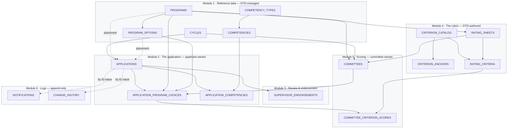

Solid arrows are SharePoint Lookup columns. Dashed arrows are relationships that exist
without a lookup — the placement columns (optional) and the two append-only logs (plain
Number, by design).

---

## Module 1 — Reference data

`CYCLES` · `PROGRAMS` · `PROGRAM_OPTIONS` · `COMPETENCY_TYPES` · `COMPETENCIES`

**The one idea:** DTD-managed lookup tables. No applicant ever writes here. Two identical
parent→child pairs teach the whole pattern once.

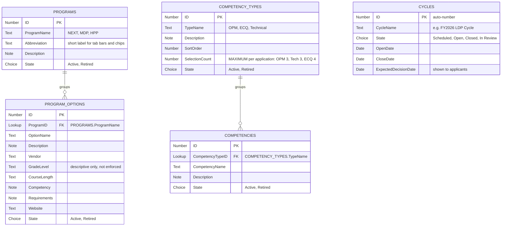

**Ask them:** why is competency *type* a list rather than a Choice column?
*Because DTD can add a row from the admin screen. Extending a Choice column needs
list-design rights and cannot be done from the app at all.*

**Gotchas**
- **Retire, never delete.** A retired row must still resolve on historical records while
  disappearing from pickers. Anything offering a choice to a user filters on `State`.
- **`SelectionCount` is data, not a constant.** The 3/3/4 limits live in the table so a
  fourth competency type is usable without a YAML edit.
- **`PROGRAMS.State` is blank on the existing three rows** (OI-DATA-2). `State.Value = "Active"`
  returns nothing, so every program picker tests `<> "Retired"` as a workaround.
  `PROGRAM_OPTIONS.State` *is* backfilled, so `= "Active"` is safe there. Two similar-looking
  filters, deliberately different.
- **Seed data:** 85 competencies (OPM 17, ECQ 20, Technical 48) from
  `build/scripts/competencies.csv`.

---

## Module 2 — The application

`APPLICATIONS` · `APPLICATION_PROGRAM_CHOICES` · `APPLICATION_COMPETENCIES`

**The one idea:** `APPLICATIONS` is the hub. Everything downstream reaches an applicant
through this row. The two joins hang off it.

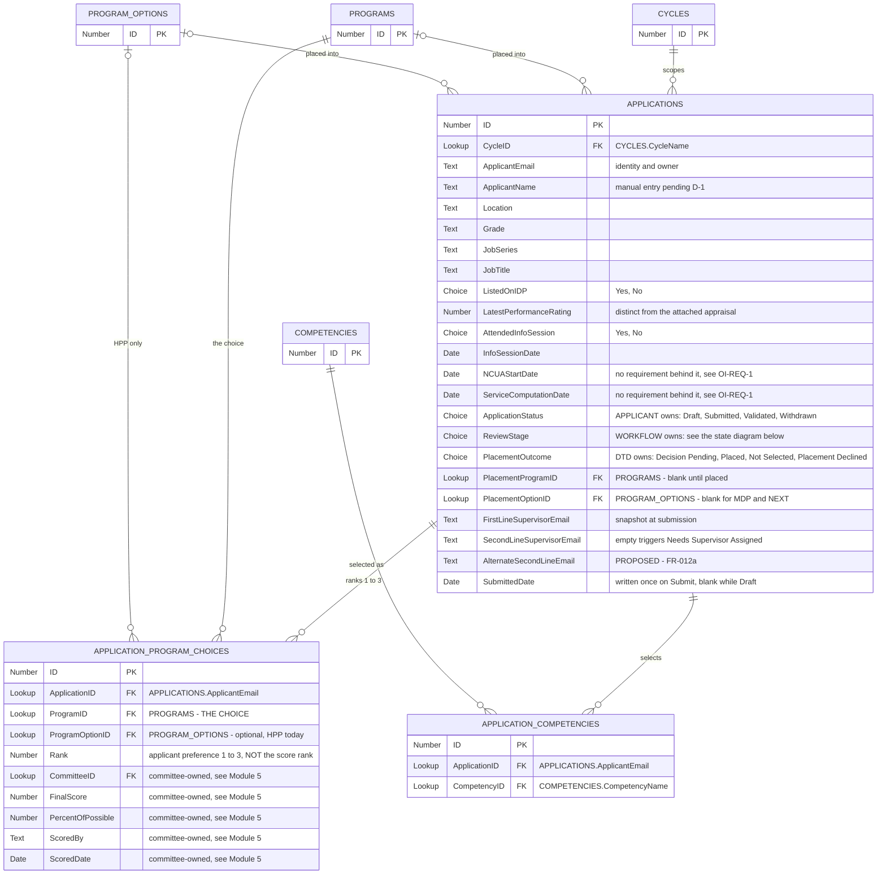

### The three status columns

Spend most of the session here. This is the hardest thing in the model and the most valuable
to transfer. Until 2026-07-31 these were **one** column.

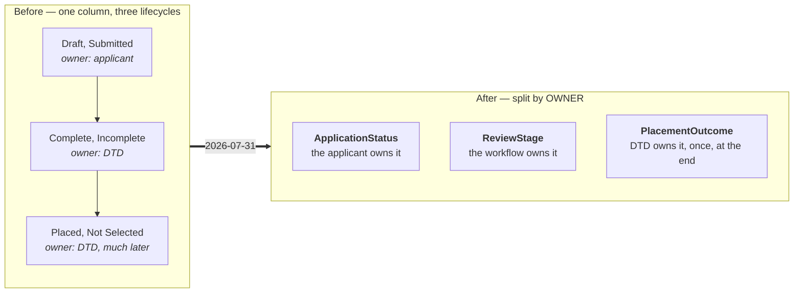

**Why it had to change:** every advance destroyed the previous answer. *"A complete
application that was not selected"* — an ordinary outcome — could not be recorded at all.

`ApplicationStatus` is linear, and a later value implies the earlier ones:

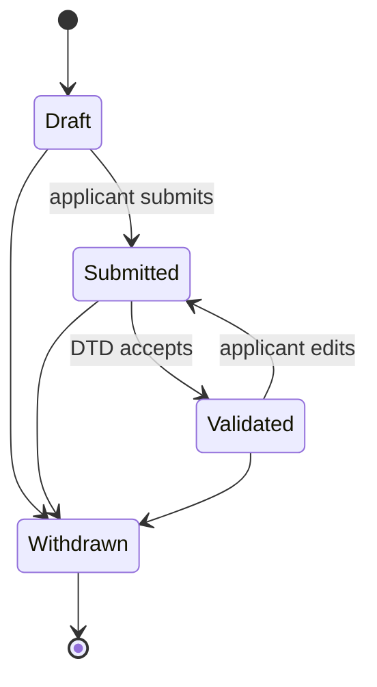

`Validated -> Submitted` on an edit is a backward transition in the machine, not a separate
flag. **Cost:** anything asking "has this been submitted?" must accept `Validated` too.

**Gotchas**
- **The choice is the PROGRAM, not the option.** `ProgramOptionID` is blank for MDP and NEXT.
  Requiring it once forced fabricated "N/A" rows.
- **Uniqueness is on the PAIR** (`ProgramID`, `ProgramOptionID`). HPP can be ranked twice with
  different options; MDP twice is still blocked, and falls out of the same rule.
- **The competency TYPE is not stored on the join.** It is the competency's parent. Copying it
  would let the two disagree.
- **`Status` and `RoutingStage` still physically exist** on the list and nothing reads them
  (OI-DATA-1). The migration deliberately separated rewrite from drop.
- **Documents are native SharePoint attachments** with no per-slot identity — nothing
  distinguishes a resume from a statement of interest (OI-APP-1).
- **Nothing enforces one application per applicant per cycle** (OI-APP-5).

---

## Module 3 — Review and endorsement

`SUPERVISOR_ENDORSEMENTS`

**The one idea:** one small table, but the routing logic is the substance of the session.

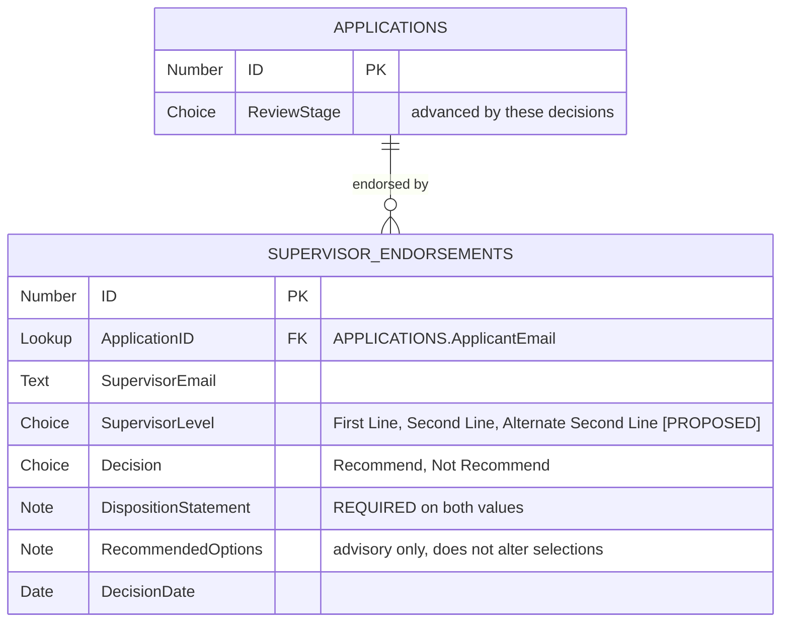

### The ReviewStage machine

Linear, with exactly one branch — at second-line routing, evaluated **after** first-line
endorsement, not at submit.

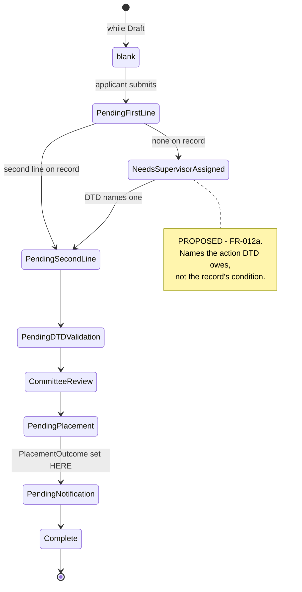

**Ask them:** does a "Not Recommend" block anything?
*No — RQ021: the application advances regardless. That is exactly why the values were renamed
from Approve/Disapprove on 2026-08-02. A supervisor has no authority to grant a place; the
column has always held an opinion wearing a word that overstated it.*

**Gotchas**
- **A supervisor disapproval does not divert the packet**, and neither does a completeness
  problem. `Complete` / `Incomplete` were removed and not replaced — they were the *verdict of
  a step*, never states the application sat in.
- **`PlacementOutcome` is set on LEAVING `Pending Placement`.** You cannot notify an applicant
  without knowing what you are telling them.
- **`ReviewStage` and `ApplicationStatus` overlap** while a packet sits at `Pending DTD
  Validation`. If that proves confusing in use, the *stage* is the one to drop.
- **RQ018 still says "approve or disapprove"** (OI-SUP-1). The requirement text is the
  customer's and was deliberately not edited.
- **Open question:** does an endorsement survive a later applicant edit? (OI-REQ-2, undecided.)

---

## Module 4 — The rubric

`CRITERION_CATALOG` · `CRITERION_ANCHORS` · `RATING_SHEETS` · `RATING_CRITERIA`

**The one idea:** catalog versus instance. The catalog is shared and unversioned; the sheet is
versioned per program; `RATING_CRITERIA` is the join that says *this criterion, on this sheet
version, in this order*.

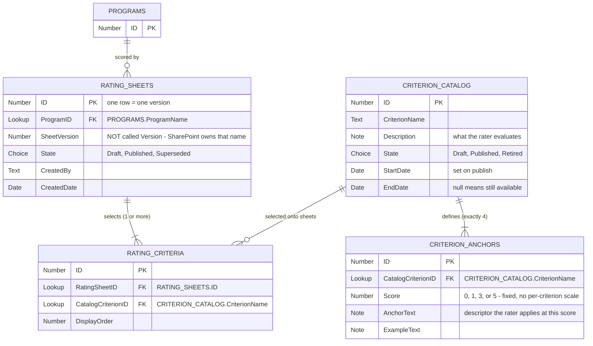

**Ask them:** how do you change a published criterion? *You don't — you create a new one.*
How do you change a sheet? *New row, `SheetVersion` n+1. At most one `Published` per program.*

**Gotchas**
- **`SheetVersion`, not `Version`.** SharePoint has a built-in field displayed as "Version"
  (`_UIVersionString`) and Power Apps binds by display name. This one costs an afternoon.
- **A sheet is per PROGRAM, not per program per cycle** (revised 2026-07-28). It is reused
  across cycles until DTD publishes a replacement.
- **Publishing supersedes the predecessor**, which is why there is no separate `IsCurrent`
  column — two columns for one lifecycle can disagree.
- **Retiring is not the same as an end date.** `Retired` is a reversible lifecycle state;
  `EndDate` says the criterion expired on a date.
- **Validation:** all four anchors before publish (FR-046); no edit once published (FR-047);
  only Published and in-window criteria are selectable onto a sheet (FR-048); committee scoring
  is blocked entirely until the program has a published sheet.

---

## Module 5 — Scoring

`COMMITTEES` · `COMMITTEE_CRITERION_SCORES` — plus a revisit of `APPLICATION_PROGRAM_CHOICES`

**The one idea:** the score lands in two places by design. Per-criterion detail as real,
queryable rows; the aggregate patched onto the choice row the committee was scoring.

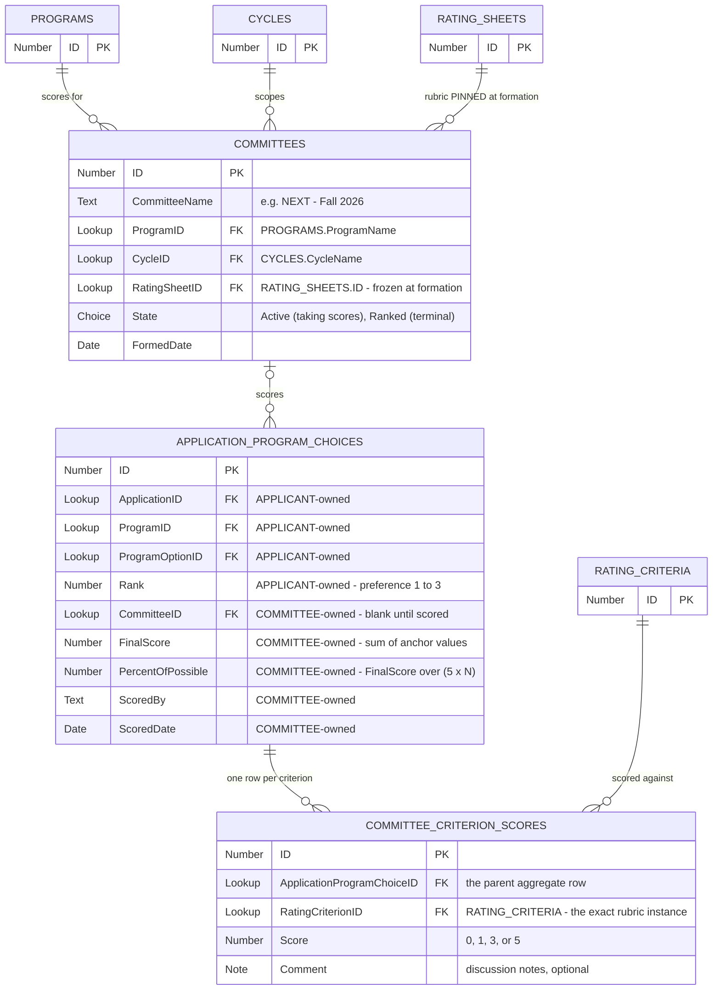

**On submit** the Score Screen writes N rows to `COMMITTEE_CRITERION_SCORES` plus **one** Patch
on the parent: `FinalScore = Sum`, `PercentOfPossible = Sum / (5 * N)`.

**Committee rank is derived at query time — there is no column for it.** `Rank` on that row is
the applicant's preference, and always was.

### Why this shape — the best teaching material in the repo

`COMMITTEE_SCORES` held both things on one row and was retired 2026-08-07:

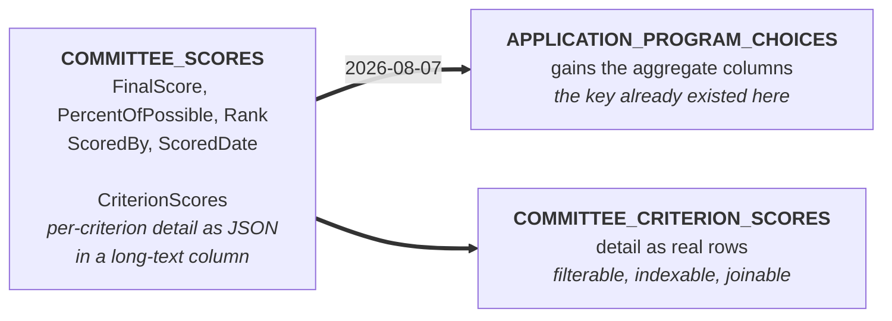

Two problems, both worth stating out loud:

1. **JSON in a long-text column is opaque.** "Show me every applicant's Leadership score" or
   "which criterion has the widest spread" meant parsing JSON in Power Fx — not delegable.
2. **The aggregate key duplicated `APPLICATION_PROGRAM_CHOICES`**, which already had one row
   per (application × program). A whole list was orbiting a key that already existed.

**Gotchas**
- **`COMMITTEES.RatingSheetID` pins the rubric at formation**, so a mid-cycle republish cannot
  disturb an in-flight committee. Every score row inherits the version through the committee.
- **`COMMITTEE_CRITERION_SCORES` links to `RATING_CRITERIA`, not `CRITERION_CATALOG`** — same
  reason. Linking to the master would lose the version pin and silently re-parent old scores on
  the next publish. Catalog identity is still one hop away.
- **Uniqueness:** one committee per (program, cycle); one score per (choice, criterion).
- **Join-table lookups display an ambiguous column** in list views (OI-DATA-3).
- DTD writes committee rows directly in Phase I; the admin screen is deferred.

---

## Module 6 — Logs

`NOTIFICATIONS` · `CHANGE_HISTORY`

**The one idea:** `ApplicationID` here is a plain **Number**, not a Lookup — deliberately, so
the log survives changes to the parent. Append-only: never update, never delete.

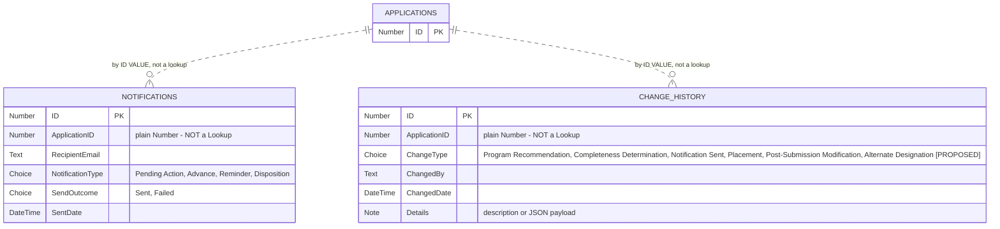

**Gotchas**
- **The app writes `NOTIFICATIONS` rows; Power Automate flows send them** (deferred, T076).
  Nothing in the app sends mail.
- **`CHANGE_HISTORY` is withheld from applicants at the SharePoint permission layer**, not by
  hiding a control (Constitution VI / OI-7, deferred).
- **No archive or retention design exists** and the constitution requires one (OI-ARCH-1).

### Close with the two cross-cutting rules

**Delegation.** Every gallery and lookup filters on an indexed, `CycleID`-scoped predicate
first. No screen loads an unfiltered list. The full index set is in
`build/lists/_RELATIONSHIPS_AND_INDEXES.md`.

**Patching a lookup from Power Fx needs the OData annotation**, or the value is silently
dropped and the row saves with an empty parent:

```
CompetencyTypeID: {
  '@odata.type': "#Microsoft.Azure.Connectors.SharePoint.SPListExpandedReference",
  Id: <type record>.ID,
  Value: <type record>.TypeName
}
```

---

## Appendix — the graveyard

Give this its own short session. Hiding these does not work: your colleagues will hit them in
`docs/` and in git history within a week, and finding them alone is worse than being told.

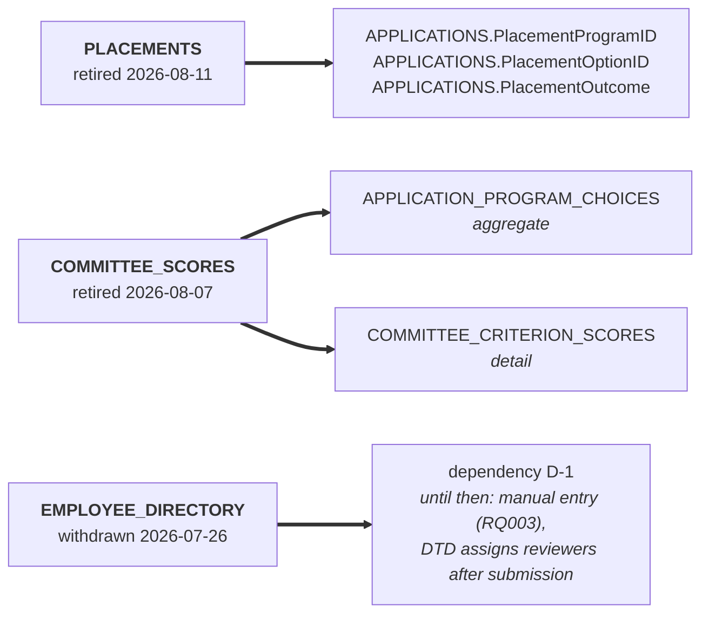

| List | Went | Why | Migration needed? |
|---|---|---|---|
| `PLACEMENTS` | 2026-08-11 | One placement per applicant is 1:1 with `APPLICATIONS`, so a whole list existed to hold two lookups. `PlacedBy` / `PlacedDate` / `IsFinalized` dropped as unneeded per DTD. | No |
| `COMMITTEE_SCORES` | 2026-08-07 | Aggregates and JSON detail on one row; the key duplicated `APPLICATION_PROGRAM_CHOICES`. | No — never populated in any environment |
| `EMPLOYEE_DIRECTORY` | 2026-07-26 | Personnel and supervisor-chain data comes from an existing system of record (D-1). The interim list was never part of the intended design. | No — never read by any screen |

If any of these lists exist in a SharePoint environment from an earlier provisioning run,
delete them manually. Nothing writes to them.

### Also worth flagging in that session

- **`APPLICATIONS.Status` and `RoutingStage`** are dead columns that still physically exist.
  Fix is a script run, no code change: `Update-LdpApplicationStatus.ps1 -RemoveOldColumns`.
- **`PROGRAMS.State` is blank** on the three existing rows, with a workaround in every picker.
- **`NCUAStartDate` / `ServiceComputationDate`** have no requirement behind them and both date
  pickers default to `Today()`, so an applicant who never touches the field submits today's
  date. Most people do not know their SCD offhand, so "didn't touch it" is the common case.
  Needs a decision from whoever owns the requirements.

The full list is `build/OPEN_ISSUES.md`. These are live traps, not history.
