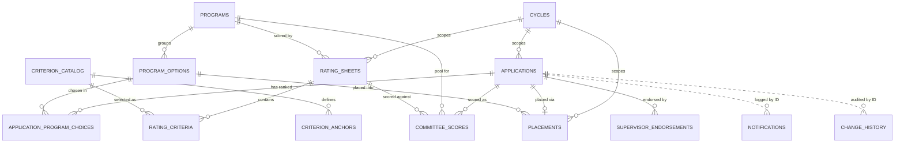

# LDP Application — Logical Data Model

> **Partially superseded 2026-08-11.** `PLACEMENTS` was retired; final placement lives on
> `APPLICATIONS.PlacementProgramID` / `PlacementOptionID`. `COMMITTEE_SCORES` was also retired
> (2026-08-07) — aggregate on `APPLICATION_PROGRAM_CHOICES`; per-criterion detail on
> `COMMITTEE_CRITERION_SCORES`. `build/lists/` is the source of truth.

**Project:** NCUA OHR Leader Development Program Application (RITM0069731)
**Scope:** Phase I
**Backend:** SharePoint lists (Power Apps)

High-level metadata for the form and list fields is provided below. Choice field values (competencies, ECQs, statuses, and similar) are cataloged in the traceability matrix (Appendix B), not here.

## Conventions

- One SharePoint list per section. Field structure follows the accepted SRS sample: Field Name, Data Type, Required?, Description.
- **Naming (ratified — Constitution v1.2.0, 2026-07-25, OI-2).** SharePoint **list** names are `UPPER_SNAKE_CASE` as written throughout this document (e.g., `APPLICATION_PROGRAM_CHOICES`); **column (field)** names are Pascal case (e.g., `ApplicantEmail`). A list name becomes its Power Fx identifier and cannot be renamed after creation, so the names here are authoritative and MUST be settled before any list is created. This closes the prior Pascal-vs-upper-snake conflict in favor of the model.
- Relationships use SharePoint Lookup columns (target list named in the Data Type), except append-only logs.
- `NOTIFICATIONS` and `CHANGE_HISTORY` store `ApplicationID` as a plain Number (not a Lookup) to preserve the log if parent data changes.
- Supporting documents (resume, statement of interest, performance rating) are native SharePoint attachments on the `APPLICATIONS` item.
- Committee scoring is hybrid: `FinalScore` and `PercentOfPossible` are queryable Numbers (the first for ranking within a pool, the second for comparison across pools); the per-criterion breakdown is stored as JSON in a memo field.
- **The criterion catalog is shared and unversioned.** `CRITERION_CATALOG` holds one reusable set of scoring criteria for all programs and cycles. A rating sheet references catalog criteria by Lookup (`RATING_CRITERIA`) rather than authoring them. A published criterion is immutable; a change is a new criterion. Availability is governed by a start date and an end date on the catalog criterion.
- Identity is M365/SharePoint (email as identity); there is no custom Users/Roles list in Phase I.
- **Three hierarchy layers.** Applicants select and rank **program options** (`APPLICATION_PROGRAM_CHOICES`); the committee pools, scores, and ranks at the **program** level (`RATING_SHEETS`, `COMMITTEE_SCORES`); DTD places into a **program option** (`PLACEMENTS`). An applicant who selects several options within one program appears once in that program's pool.

## Entity relationships

Solid lines are Lookup relationships; dashed lines are the append-only logs (related by ID value, not a Lookup). `||--o{` is one-to-many; `APPLICATIONS ||--o| PLACEMENTS` is one-to-zero-or-one (an applicant has at most one placement).

## Lists

| List | Purpose | Key relationships |
|---|---|---|
| CYCLES | An application cycle: its state and key dates. | Referenced by APPLICATIONS, RATING_SHEETS, PLACEMENTS |
| PROGRAMS | The three program groupings (NEXT, MDP, HPP). | Parent of PROGRAM_OPTIONS |
| PROGRAM_OPTIONS | The nine selectable options under programs. | Child of PROGRAMS; referenced widely |
| APPLICATIONS | The central application record. | Belongs to a CYCLE; parent of choices, endorsements, scores |
| APPLICATION_PROGRAM_CHOICES | An applicant's ranked program-option selections. | Joins APPLICATIONS and PROGRAM_OPTIONS (with rank) |
| SUPERVISOR_ENDORSEMENTS | Each supervisor's decision, statement, recommendations. | Child of APPLICATIONS |
| RATING_SHEETS | A committee rating sheet, versioned, per program per cycle. | Belongs to CYCLE and PROGRAM; parent of criteria |
| RATING_CRITERIA | The criteria selected onto a rating sheet version, each referencing a catalog criterion. | Child of RATING_SHEETS; references CRITERION_CATALOG |
| CRITERION_CATALOG | The shared master set of scoring criteria, reusable across all programs and cycles. | Parent of CRITERION_ANCHORS; referenced by RATING_CRITERIA |
| CRITERION_ANCHORS | The four scoring anchors (0, 1, 3, 5) for a catalog criterion. | Child of CRITERION_CATALOG |
| COMMITTEE_SCORES | An applicant's score for a program (hybrid). | Joins APPLICATION, PROGRAM, RATING_SHEET |
| PLACEMENTS | DTD's final placement of an applicant. | Joins APPLICATION and PROGRAM_OPTION within a CYCLE |
| NOTIFICATIONS | Append-only log of notifications sent. | References APPLICATIONS by ID value (not Lookup) |
| CHANGE_HISTORY | Append-only audit trail of consequential changes. | References APPLICATIONS by ID value (not Lookup) |

---

## CYCLES

An application cycle: its state and key dates.

| Field Name | Data Type | Required? | Description |
|---|---|---|---|
| ID | Number | Yes | The unique identifier of the application cycle. |
| CycleName | Single line of text | Yes | The name of the cycle (e.g., "FY2026 LDP Cycle"). |
| State | Choice | Yes | The cycle's current state: Scheduled, Open, Closed, or In Review. |
| OpenDate | Date | Yes | The date applications are intended to open. |
| CloseDate | Date | Yes | The date applications are intended to close. |
| ExpectedDecisionDate | Date | Yes | The date by which a decision is expected; shown to applicants. |

## PROGRAMS

The three program groupings (NEXT, MDP, HPP).

| Field Name | Data Type | Required? | Description |
|---|---|---|---|
| ID | Number | Yes | The unique identifier of the program. |
| ProgramName | Single line of text | Yes | The name of the program (NEXT, MDP, HPP). |
| ProgramCode | Single line of text | Yes | The short code for the program (NEXT, MDP, HPP). |
| Description | Multiple lines of text | No | A description of the program. |

## PROGRAM_OPTIONS

The nine selectable options under programs.

| Field Name | Data Type | Required? | Description |
|---|---|---|---|
| ID | Number | Yes | The unique identifier of the program option. |
| ProgramID | Lookup (PROGRAMS) | Yes | The parent program this option belongs to. |
| OptionName | Single line of text | Yes | The name of the program option (e.g., "Mini MBA: Management & Leadership"). |
| Description | Multiple lines of text | No | A description of the program option. |
| Vendor | Single line of text | No | The vendor delivering the program option. |
| GradeLevel | Single line of text | No | The grade band(s) the option targets (e.g., "CU-12, CU-11"). Descriptive only; eligibility is not system-enforced. |
| CourseLength | Single line of text | No | The duration of the program option. |
| Competency | Multiple lines of text | No | The competencies the option addresses. |
| Requirements | Multiple lines of text | No | The requirements or prerequisites for the option. |
| Website | Single line of text | No | The URL for more information about the option. |

## APPLICATIONS

The central application record. Supporting documents (resume, statement of interest, performance rating) are stored as native SharePoint attachments on this item.

| Field Name | Data Type | Required? | Description |
|---|---|---|---|
| ID | Number | Yes | The unique identifier of the application. |
| CycleID | Lookup (CYCLES) | Yes | The cycle this application belongs to. |
| ApplicantEmail | Single line of text | Yes | The email of the applicant (identity/owner). |
| ApplicantName | Single line of text | Yes | The applicant's name (from HR Links or manual entry). |
| Location | Single line of text | No | The applicant's location (from HR Links or manual entry). |
| Grade | Single line of text | No | The applicant's grade. |
| JobSeries | Single line of text | No | The applicant's job series. |
| JobTitle | Single line of text | No | The applicant's job title. |
| OPMCompetencies | Multiple lines of text | No | The three selected OPM competencies (values in the traceability matrix). |
| TechnicalCompetencies | Multiple lines of text | No | The three selected technical competencies. |
| ECQs | Multiple lines of text | No | The four selected Executive Core Qualifications. |
| ListedOnIDP | Choice | No | Whether the request was listed on the applicant's IDP (Yes/No). |
| LatestPerformanceRating | Number | No | The applicant's latest performance rating. |
| AttendedInfoSession | Choice | No | Whether the applicant attended an informational session (Yes/No). |
| InfoSessionDate | Date | No | The date of the informational session attended, if any. |
| NCUAStartDate | Date | No | The applicant's NCUA start date. |
| ServiceComputationDate | Date | No | The applicant's service computation date. |
| Status | Choice | Yes | The application's state: Draft, Submitted, Complete, Incomplete, Placed, Not Selected. |

## APPLICATION_PROGRAM_CHOICES

An applicant's ranked program-option selections (join of APPLICATIONS and PROGRAM_OPTIONS).

| Field Name | Data Type | Required? | Description |
|---|---|---|---|
| ID | Number | Yes | The unique identifier of the program choice. |
| ApplicationID | Lookup (APPLICATIONS) | Yes | The application this choice belongs to. |
| ProgramOptionID | Lookup (PROGRAM_OPTIONS) | Yes | The program option the applicant selected. |
| Rank | Number | Yes | The applicant's ranking of this choice (1 = highest, up to 3). |

## SUPERVISOR_ENDORSEMENTS

Each supervisor's endorsement decision, statement, and program recommendations.

| Field Name | Data Type | Required? | Description |
|---|---|---|---|
| ID | Number | Yes | The unique identifier of the endorsement. |
| ApplicationID | Lookup (APPLICATIONS) | Yes | The application being endorsed. |
| SupervisorEmail | Single line of text | Yes | The email of the supervisor recording the decision. |
| SupervisorLevel | Choice | Yes | Which supervisor: First Line or Second Line. |
| Decision | Choice | Yes | The endorsement decision: Approve or Disapprove. |
| DispositionStatement | Multiple lines of text | Yes | The supervisor's justification for the decision. |
| RecommendedOptions | Multiple lines of text | No | Alternative program options the supervisor recommends (advisory; does not alter the applicant's selections). |
| DecisionDate | Date | Yes | The date the decision was recorded. |

## RATING_SHEETS

A committee rating sheet, immutably versioned, per program per cycle.

| Field Name | Data Type | Required? | Description |
|---|---|---|---|
| ID | Number | Yes | The unique identifier of the rating sheet version. |
| CycleID | Lookup (CYCLES) | Yes | The cycle this rating sheet belongs to. |
| ProgramID | Lookup (PROGRAMS) | Yes | The program this sheet scores. |
| Version | Number | Yes | The version number of this sheet. |
| State | Choice | Yes | The sheet's state: Draft or Published. |
| IsCurrent | Choice | Yes | Whether this is the current (latest) version (Yes/No). |
| CreatedBy | Single line of text | Yes | The DTD user who created this version. |
| CreatedDate | Date | Yes | The date this version was saved. |

## RATING_CRITERIA

The criteria selected onto a rating sheet version. Each row references a catalog criterion; the criterion's name, description, anchors, and examples live on `CRITERION_CATALOG`, not here.

| Field Name | Data Type | Required? | Description |
|---|---|---|---|
| ID | Number | Yes | The unique identifier of the selected criterion. |
| RatingSheetID | Lookup (RATING_SHEETS) | Yes | The rating sheet version this selection belongs to. |
| CatalogCriterionID | Lookup (CRITERION_CATALOG) | Yes | The catalog criterion selected onto this sheet. |
| DisplayOrder | Number | No | The order this criterion appears on the sheet. |

## CRITERION_CATALOG

The shared master set of scoring criteria, reusable across all programs and cycles. Not versioned and not cycle-scoped; a published criterion is immutable, and a change is made by creating a new criterion.

| Field Name | Data Type | Required? | Description |
|---|---|---|---|
| ID | Number | Yes | The unique identifier of the catalog criterion. |
| CriterionCode | Single line of text | Yes | The stable criterion code (e.g., "C01"). |
| CriterionName | Single line of text | Yes | The name of the criterion. |
| Description | Multiple lines of text | Yes | What the rater evaluates for this criterion. |
| State | Choice | Yes | The criterion's state: Draft or Published. |
| StartDate | Date | No | The date the criterion became available for selection (set on publish). |
| EndDate | Date | No | The date the criterion was retired; null means still available. |

## CRITERION_ANCHORS

The four scoring anchors for a catalog criterion. Four rows per criterion, one per score.

| Field Name | Data Type | Required? | Description |
|---|---|---|---|
| ID | Number | Yes | The unique identifier of the anchor. |
| CatalogCriterionID | Lookup (CRITERION_CATALOG) | Yes | The catalog criterion this anchor belongs to. |
| Score | Number | Yes | The anchor's score: 0, 1, 3, or 5. |
| AnchorText | Multiple lines of text | Yes | The descriptor the rater applies for this score. |
| ExampleText | Multiple lines of text | No | An illustrative example at this score. |

## COMMITTEE_SCORES

An applicant's score for a program. Hybrid: `FinalScore` and `PercentOfPossible` are queryable; the per-criterion breakdown is JSON.

| Field Name | Data Type | Required? | Description |
|---|---|---|---|
| ID | Number | Yes | The unique identifier of the score record. |
| ApplicationID | Lookup (APPLICATIONS) | Yes | The applicant being scored. |
| ProgramID | Lookup (PROGRAMS) | Yes | The program pool this score is for. |
| RatingSheetID | Lookup (RATING_SHEETS) | Yes | The published rating sheet version scored against. |
| FinalScore | Number | Yes | The summed total score (queryable; used for ranking within a pool). |
| PercentOfPossible | Number | No | The final score as a percentage of the maximum (five times the criterion count); used to compare applicants across program pools at placement. |
| CriterionScores | Multiple lines of text | No | Per-criterion breakdown stored as JSON (criterion name, points). |
| Rank | Number | No | The applicant's rank within this program pool. |
| ScoredBy | Single line of text | No | The committee recorder who entered the score. |
| ScoredDate | Date | No | The date scoring was completed for this applicant. |

## PLACEMENTS

DTD's final placement of an applicant into a program option within a cycle.

| Field Name | Data Type | Required? | Description |
|---|---|---|---|
| ID | Number | Yes | The unique identifier of the placement. |
| ApplicationID | Lookup (APPLICATIONS) | Yes | The applicant being placed. |
| ProgramOptionID | Lookup (PROGRAM_OPTIONS) | Yes | The program option the applicant is placed into. |
| CycleID | Lookup (CYCLES) | Yes | The cycle this placement belongs to. |
| PlacedBy | Single line of text | Yes | The DTD user who recorded the placement. |
| PlacedDate | Date | Yes | The date the placement was recorded. |
| IsFinalized | Choice | Yes | Whether the placement has been finalized/locked (Yes/No). |

## NOTIFICATIONS

Append-only log of notifications sent. `ApplicationID` is a plain Number to preserve the log.

| Field Name | Data Type | Required? | Description |
|---|---|---|---|
| ID | Number | Yes | The unique identifier of the notification record. |
| ApplicationID | Number | Yes | The application the notification concerns (stored as ID value, not Lookup). |
| RecipientEmail | Single line of text | Yes | The email of the notification recipient. |
| NotificationType | Choice | Yes | The type: Pending Action, Advance, Reminder, Disposition. |
| SendOutcome | Choice | Yes | The outcome: Sent or Failed. |
| SentDate | Date | Yes | The date and time the notification was sent. |

## CHANGE_HISTORY

Append-only audit trail. `ApplicationID` is a plain Number to preserve the trail.

| Field Name | Data Type | Required? | Description |
|---|---|---|---|
| ID | Number | Yes | The unique identifier of the history entry. |
| ApplicationID | Number | Yes | The application the change concerns (stored as ID value, not Lookup). |
| ChangeType | Choice | Yes | The kind of change: Program Recommendation, Completeness Determination, Notification Sent, Placement. |
| ChangedBy | Single line of text | Yes | The user who made the change. |
| ChangedDate | Date | Yes | The date and time the change occurred. |
| Details | Multiple lines of text | No | A description or JSON payload of what changed. |

---

## Notes

- **Shared rating criterion catalog (new).** `RATING_CRITERIA` was collapsed from an authored criterion (name, type, min/max/fixed points) to a join that references a catalog criterion, with a display-order field. Two entities were added: `CRITERION_CATALOG` (the shared master criteria, unversioned) and `CRITERION_ANCHORS` (the four 0/1/3/5 anchors per criterion). `COMMITTEE_SCORES` gained `PercentOfPossible` for cross-pool comparison, and its `CriterionScores` JSON no longer carries a criterion type. Supports RQ083 and RQ109–RQ119. The `CriterionCode` field carries the C01-style codes from the catalog artifact; it is a stable identifier, not a display name.
- **APPLICATIONS.Status values are inferred from the use cases** (Draft, Submitted, Complete, Incomplete, Placed, Not Selected), not read from a source field spec. Validate against how the application implements state.
- **Choice field values are deferred to the traceability matrix** (Appendix B), matching the accepted SRS sample.
